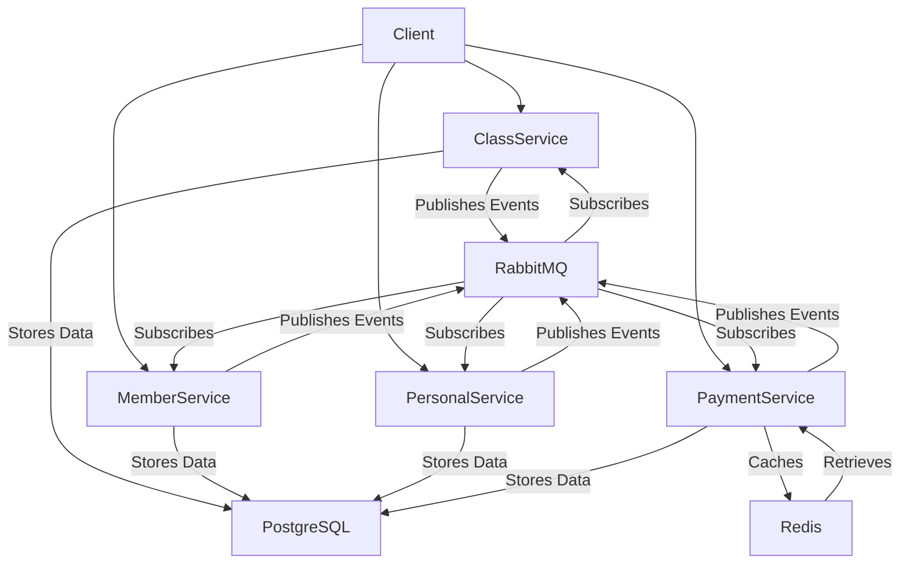
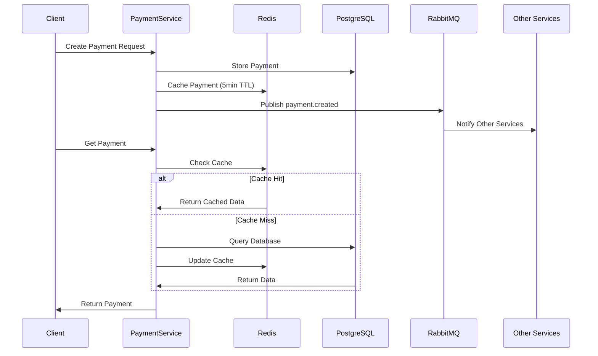

# MicroManagement
A microservices-based payment processing system that utilizes Redis for caching payment data and RabbitMQ for inter-service communication, ensuring high performance and reliable message delivery across services.

## System Architecture



## Services

### 1. ClassService (Port: 5041)
- Manages class-related operations
- Database: PostgreSQL (classdb)
- Events:
  - class.created
  - class.updated
  - class.deleted

### 2. MemberService (Port: 5062)
- Handles member management
- Database: PostgreSQL (memberdb)
- Events:
  - member.created
  - member.updated
  - member.deleted

### 3. PersonalService (Port: 5104)
- Manages personnel information
- Database: PostgreSQL (personaldb)
- Events:
  - personal.created
  - personal.updated
  - personal.deleted

### 4. PaymentService (Port: 5019)
- Processes payments with caching
- Database: PostgreSQL (paymentdb)
- Cache: Redis (5 minutes TTL)
- Events:
  - payment.created
  - payment.updated
  - payment.deleted

## Data Flow



## Technologies

- .NET 9.0
- PostgreSQL
- Redis
- RabbitMQ
- Docker & Docker Compose

## Setup

1. Clone the repository
2. Run Docker Compose:
```bash
docker-compose up -d
```

3. Access Services:
- ClassService: http://localhost:5041/swagger
- MemberService: http://localhost:5062/swagger
- PersonalService: http://localhost:5104/swagger
- PaymentService: http://localhost:5019/swagger
- RabbitMQ Management: http://localhost:15672 (guest/guest)

## Environment Variables

Each service requires the following environment variables (set in docker-compose.yml):

```yaml
ConnectionStrings__PostgreSQL: "Host=postgres;Database=dbname;Username=postgres;Password=postgres"
RabbitMQ__HostName: "rabbitmq"
```

Additionally for PaymentService:
```yaml
ConnectionStrings__Redis: "redis:6379"
```

## Monitoring

- **PostgreSQL**: Each service has its own database
- **Redis**: Monitor cache through Redis Insight or CLI
- **RabbitMQ**: Monitor message queues through RabbitMQ Management UI

## Testing

1. Create a payment:
```json
{
  "memberId": 1,
  "amount": 150.50,
  "paymentMethod": "CreditCard",
  "status": "Pending"
}
```

2. Verify in:
- PostgreSQL: Data persistence
- Redis: Cache (5min TTL)
- RabbitMQ: Message publication

## Error Handling

- Database connection issues: Automatic retry policies
- Redis cache misses: Fallback to PostgreSQL
- RabbitMQ connection issues: Retry with exponential backoff 
